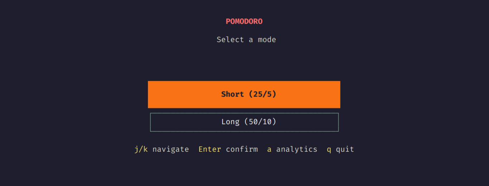
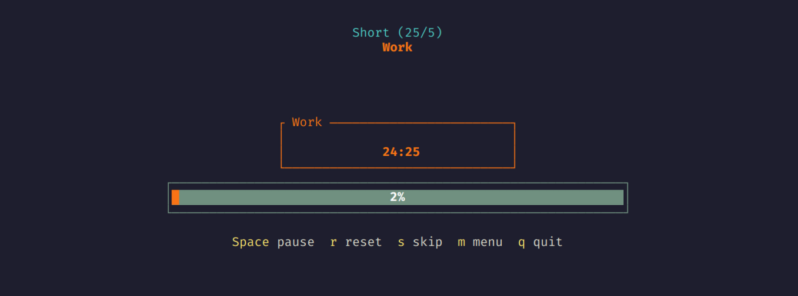

# pomo-rusTui

A terminal-based Pomodoro timer written in Rust using ratatui.

## Screenshots

### Mode Selection


### Timer


### Analytics


## Features

- Two pomodoro modes:
  - Short: 25 minutes work / 5 minutes break
  - Long: 50 minutes work / 10 minutes break
- Timer with pause, reset, and skip functionality
- Analytics tracking with persistence
  - Daily, weekly, and total counts
  - Current streak
  - Breakdown by mode
- Colorful TUI interface
- Confirmation dialog when exiting active timer

## Installation

```bash
git clone https://github.com/Dr-Manhattan-Jr/pomo-rusTui.git
cd pomo-rusTui
cargo build --release
```

The binary will be at `target/release/pomo-rusTui`.

## Usage

```bash
cargo run
```

Or run the compiled binary directly.

## Controls

### Mode Selection

| Key | Action |
|-----|--------|
| j / Down | Navigate down |
| k / Up | Navigate up |
| Enter | Start timer |
| a | View analytics |
| q | Quit |

### Timer

| Key | Action |
|-----|--------|
| Space | Pause / Resume |
| r | Reset current phase |
| s | Skip to next phase |
| m / Esc | Return to menu |
| q | Quit |

### Analytics

| Key | Action |
|-----|--------|
| b / Esc | Back to menu |
| c | Clear all data |
| q | Quit |

## Data Storage

Analytics are saved to `~/.local/share/pomo/rustui/analytics.json`.

## Dependencies

- ratatui - Terminal UI framework
- crossterm - Terminal manipulation
- tokio - Async runtime
- serde / serde_json - Serialization
- chrono - Date/time handling
- directories - Platform-specific directories

## Development

```bash
# Run tests
cargo test

# Run with clippy
cargo clippy

# Format code
cargo fmt
```

## License

MIT
